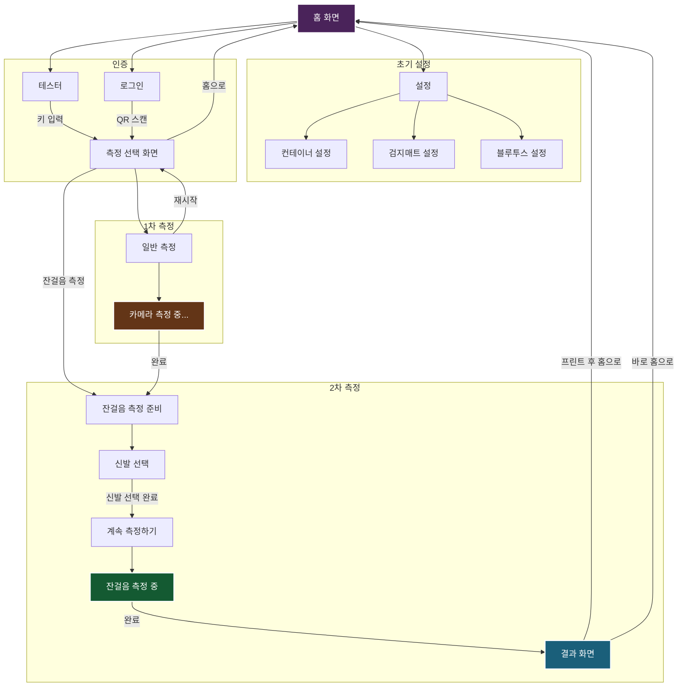

```mermaid
    flowchart TD 
    Home[홈 화면] --> Settings[설정]
    Home --> Tester[테스터]
    Home --> Login[로그인]
    
    subgraph "초기 설정"
        Settings --> ContainerSet[컨테이너 설정]
        Settings --> MatSet[검지매트 설정]
        Settings --> BTSet[블루투스 설정]
    end
    
    subgraph "인증"
        Tester --> |키 입력| MeasureSelect
        Login --> |QR 스캔| MeasureSelect
    end
    
    MeasureSelect[측정 선택 화면] --> NormalMeasure[일반 측정]
    MeasureSelect --> |잔걸음 측정| SmallStepReady
    MeasureSelect --> |홈으로| Home
    
    subgraph "1차 측정"
        NormalMeasure --> CameraRecord[카메라 측정 중...]
        NormalMeasure --> |재시작| MeasureSelect
    end
    
    subgraph "2차 측정"
        CameraRecord --> |완료| SmallStepReady
        SmallStepReady[잔걸음 측정 준비] --> ShoeSelect[신발 선택]
        ShoeSelect --> |신발 선택 완료| ContinueMeasure[계속 측정하기]
        ContinueMeasure --> SmallStepMeasuring[잔걸음 측정 중]
        SmallStepMeasuring --> |완료| Result[결과 화면]
    end
    
    Result --> |프린트 후 홈으로| Home
    Result --> |바로 홈으로| Home

    style Home fill:#4a235a,stroke:#fff,stroke-width:2px,color:#fff
    style Result fill:#1a5f7a,stroke:#fff,stroke-width:2px,color:#fff
    style SmallStepMeasuring fill:#145a32,stroke:#fff,stroke-width:2px,color:#fff
    style CameraRecord fill:#633517,stroke:#fff,stroke-width:2px,color:#fff
```